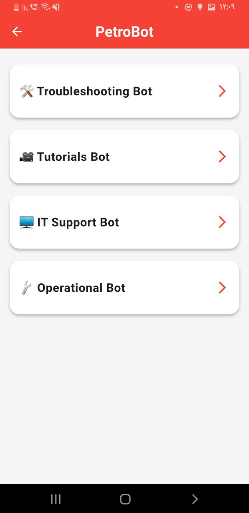
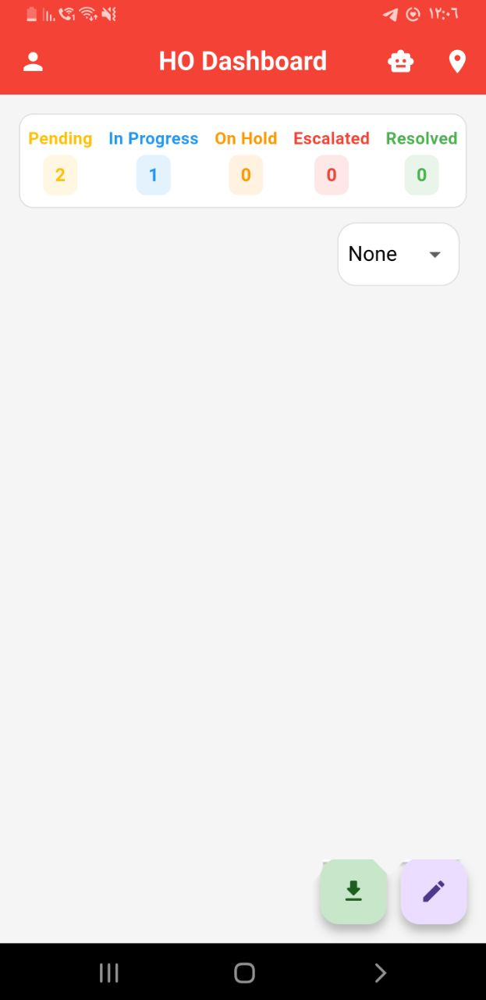
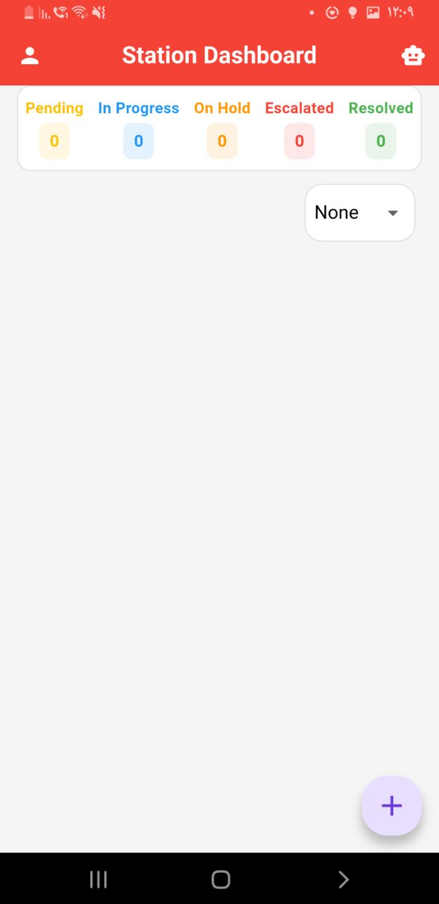

# 📌 TrackMin — Issue Tracking & Support for Fuel Stations  
TrackMin is a cross-platform system for reporting, tracking, and resolving technical and operational issues across fuel stations. It streamlines collaboration between station staff and head-office teams and includes a built-in assistant, **PetroBot**, for troubleshooting and standard procedures.  
> This repository provides **public documentation and screenshots**. No proprietary links, credentials, script, or real station data are included.  

## ✨ Features  
- **Cross-platform UI (Flutter)** — Mobile, web, and desktop.  
- **Issue lifecycle** — Pending, In Progress, On Hold, Escalated, Resolved.  
- **Smart filtering** — Filter by status, severity, station, and date.  
- **Auto-escalation** — Severity-based timers within business hours.  
- **Email notifications** — Automatic updates on status changes.  
- **Multi-assignment** — Assign multiple employees to a single issue.  
- **PetroBot assistant** — Troubleshooting, IT support tips, and SOP guidance.  

## 🧠 PetroBot  
The embedded assistant accelerates resolution by providing:  
- **Troubleshooting steps** for common symptoms (e.g., “MPOS not connecting”, “Pump out of order”).  
- **IT support guidance** for Wi-Fi, printers, PCs, monitors, and switch-port lights.  
- **Standard procedures (SOPs)** such as shift opening/closing, cash management, and deliveries.  
- **Training titles lookup** for internal materials (links are not published here).  

## 🧱 Architecture  
- **Frontend:** Flutter (single codebase across platforms)  
- **Backend:** Flask (Python) with scheduled jobs via APScheduler  
- **Database:** PostgreSQL  
- **Notifications:** Email on status changes  
- **Escalation rules:** Time thresholds by severity during business hours  

## 📊 Dashboards  
- **Head Office (Manager View):** Global oversight, filters, assignments, and escalation controls.  
- **Station View:** Station-specific issues with simplified actions and updates.  

## 📷 Screenshots  
> Images below use **demo data** only.  

**PetroBot** – Answers common issues with step-by-step guidance.  
  

**Company Dashboard (Manager View)** – Global view with status filters and issue list.  
  

**Station Dashboard (Station View)** – Station-specific issues only.  
  

## 🧪 Example API (Illustrative)  
**Troubleshooting**  
```
POST /chatbot
Content-Type: application/json

{ "question": "The MPOS is not connecting to the network" }
```
**IT Support**  
```
POST /IT_Support
Content-Type: application/json

{ "question": "My monitor is black" }
```
**Procedures (SOP)**  
```
POST /procedure_chatbot
Content-Type: application/json

{ "question": "closing shift procedure" }
```
**Training Titles**  
```
GET /video?title=tutorial
```  

## 🗺 Roadmap  
- AI-assisted root-cause suggestions and fix recommendations  
- Live chat hand-off to human support  
- Advanced analytics on issue trends and station performance  

## 🔒 Privacy Note  
Screenshots and examples in this repository use **demo data** only and do not represent real stations, staff, or incidents.  

## 📄 License & Attribution  
Documentation prepared as part of a summer training project. Production code and private assets remain internal.  
